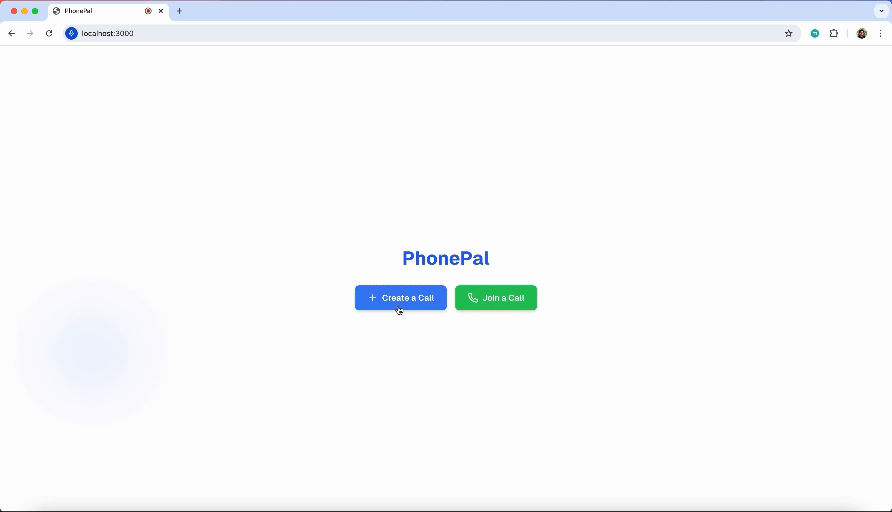

# PhonePal

Real-time translation of voice calls 

The audio processing pipeline uses Groq for fast inference of Whisper to transcribe the sender. The sender's transcription is then translated into the receiver's target language with Groq `llama3-8b-8192` as a zero-shot translator. The audio of the translation is then generated using Cartesia `sonic-english` or `sonic-multilingual` in the voice of the original sender using voice cloning and sent to the receiver over a Websocket. 

Current languages supported on PhonePal: English, Spanish, German, and French. 

This project was bootstrapped from [swift](https://github.com/ai-ng/swift.git). 

## Set up

-   Clone repo
-   Copy `.env.example` to `.env.local` and add environment variables.
-   Run `pnpm install` to install dependencies.
-   Run `node server.mjs` to run the server-side. 
-   Run `pnpm dev` to start the client-side.
-   To simulate a call, open two seperate `localhost:3000` on your browser and have them join the same call
